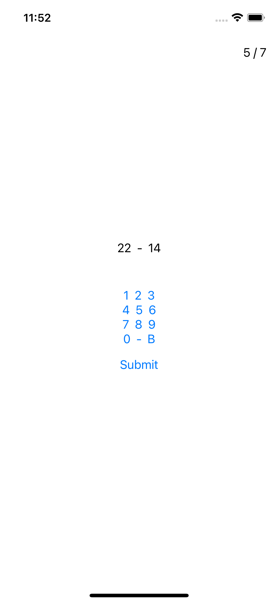
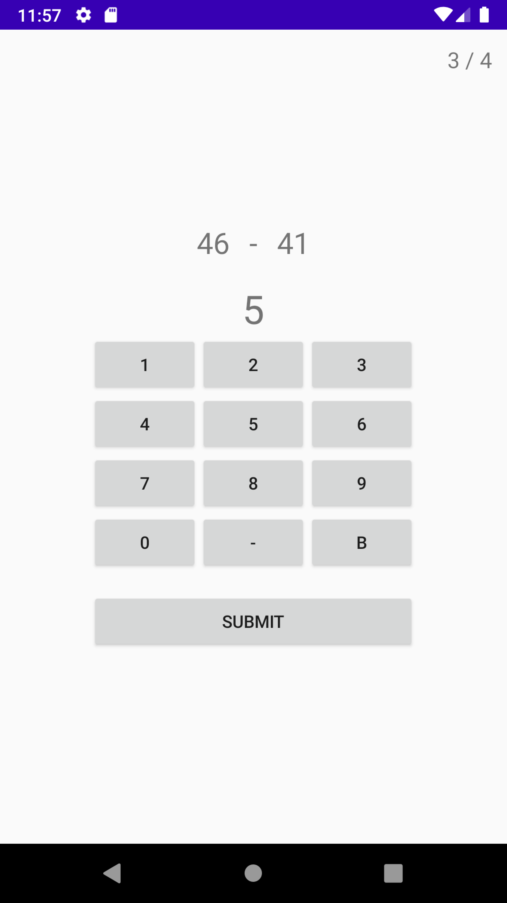

Do Math!
========

This is a little personal experiment discovering Kotlin Multiplatform Mobile for android and iOS development.

There are three different tools implemented via KMM:
`MathProblmentsGenerator` - a little tool that randomly generates some simple math problems
`SuggestedResultWrapper` - the class that takes user input and makes sure to generate a nice string to show to the user to display the result
`PracticeTracker` - to keep track of correct/total statistics for the users progressions

Both iOS and Android implementations use these classes to generate some math problems and check the results while displaying useful info to the user.

